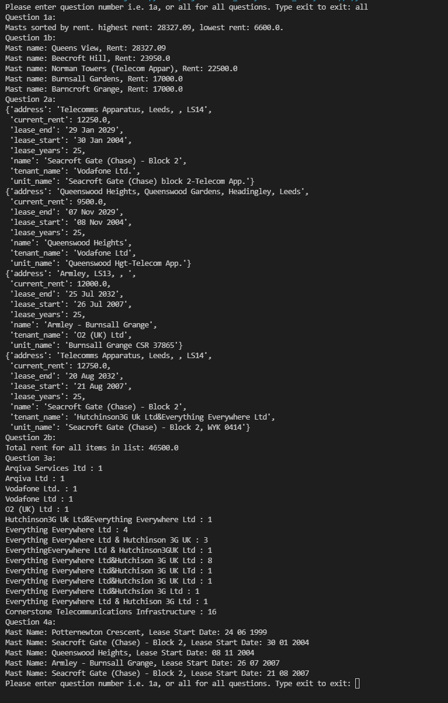
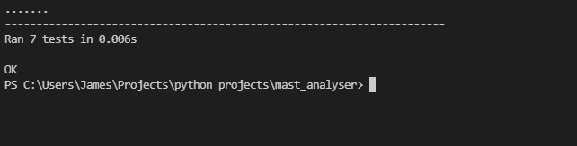

# Mast Analyser App

## Table of contents

- [Mast Analyser App](#mast-analyser-app)
  - [Table of contents](#table-of-contents)
  - [General info](#general-info)
  - [Technologies](#technologies)
  - [Status](#status)
  - [Tests](#tests)

## General info

Mast Analyser app for the bink technical test.

Output for all questions below:

Usage: python app.py

Test: python test_app.py

User input via the command line to select questions and answers:
    input: 1a, 1b, 2a, 2b, 3a, 4a, all, exit.

Output: answers, all answers or exit.

## Technologies

- Python 3.10
- pipenv

## Status

Project is: alpha v0.1

## Tests

test output below:

